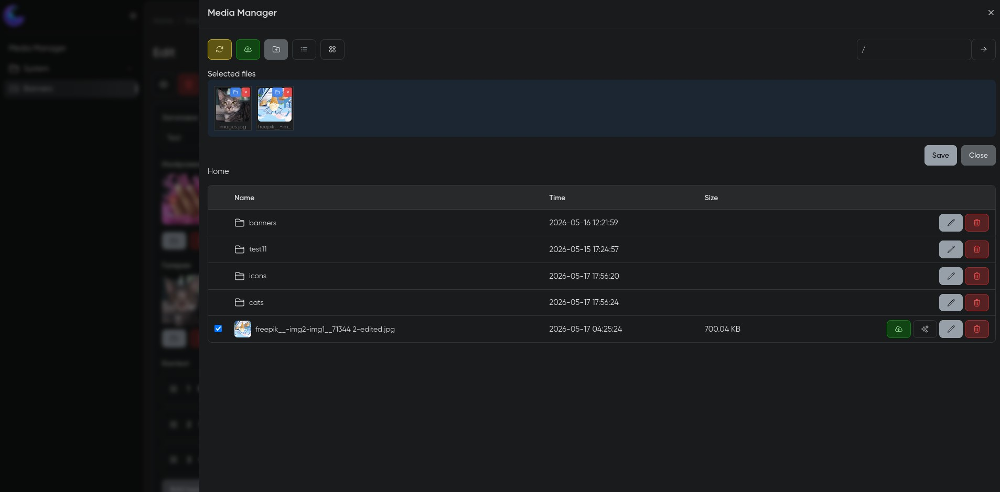
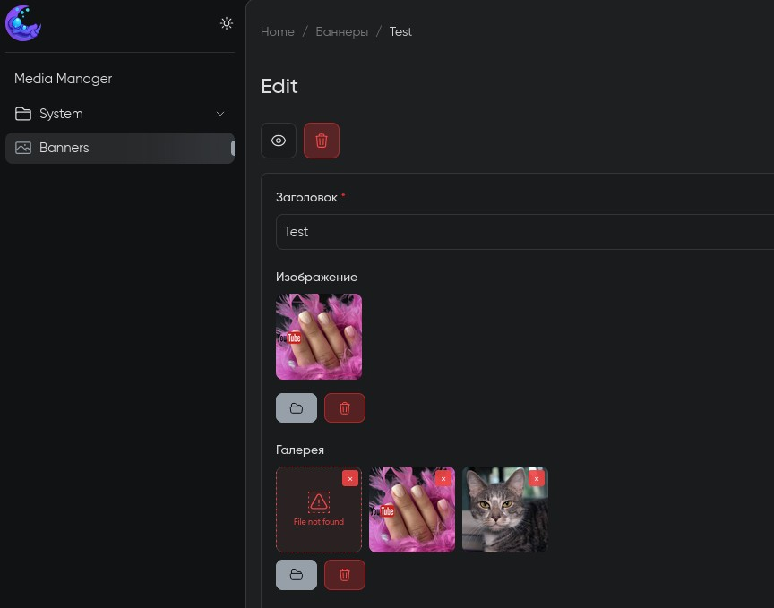

# MoonShine Media Manager

Файловый менеджер для [MoonShine](https://moonshine-laravel.com/).

### Поддержка версий

| MoonShine | Пакет | Документация                        |
|-----------|-------|-------------------------------------|
| 4.0+      | 4.x   | [Ниже ↓](#настройка-v4-moonshine-4) |
| 4.0+      | 3.x   | [Ниже ↓](#настройка-v3-moonshine-4) |
| 3.0+      | 2.x   |                                     |
| 2.0+      | 1.x   |                                     |

## Скриншоты

<table>
    <tr>
        <td align="center"><b>Менеджер</b></td>
        <td align="center"><b>Пикер</b></td>
    </tr>
    <tr>
        <td></td>
        <td></td>
    </tr>
</table>

## Установка

```bash
composer require yurizoom/moonshine-media-manager
```

---

## Настройка v4 (MoonShine 4+)

Полностью AJAX — загрузка, удаление, переименование, навигация по папкам без перезагрузки страницы.

После установки опубликуйте ассеты и конфиг:

```bash
php artisan vendor:publish --tag=moonshine-media-manager-assets
php artisan vendor:publish --tag=moonshine-media-manager-config
```

### Конфигурация

Конфиг публикуется в `config/media-manager.php` (корневой файл). Поддерживается
fallback — если ключи найдены в `config/moonshine.php` → `media_manager`, они
тоже применяются. Приоритет: standalone файл > `moonshine.php` > дефолты пакета.

```php
// config/media-manager.php
return [
    'disk' => config('filesystems.default', 'public'),
    'allowed_ext' => 'jpg,jpeg,png,gif,webp,avif,svg,bmp,ico,heic,pdf,doc,docx,xls,xlsx,ppt,pptx,zip,rar,7z,tar,gz,txt,md,csv,json,yaml,yml,mp3,wav,ogg,m4a,aac,flac,mp4,avi,mov,mkv,webm',
    'max_file_size' => env('MOONSHINE_MEDIA_MANAGER_MAX_FILE_SIZE', 10 * 1024 * 1024),
    'rename_duplicates' => env('MOONSHINE_MEDIA_MANAGER_RENAME_DUPLICATES', true),
    'auto_menu' => env('MOONSHINE_MEDIA_MANAGER_AUTO_MENU', true),
    'ability' => env('MOONSHINE_MEDIA_MANAGER_ABILITY'),
    'default_view' => 'table',
];
```

### Подключение OffCanvas

В `app/MoonShine/Layouts/MoonShineLayout.php`:

```php
use YuriZoom\MoonShineMediaManager\Components\MediaManagerOffCanvas;

final class MoonShineLayout extends AppLayout
{
    protected function getContentComponents(): array
    {
        return [
            ...parent::getContentComponents(),
            MediaManagerOffCanvas::make(),
        ];
    }
}
```

`MediaManagerOffCanvas` — глобальный компонент, рендерит offcanvas-панель с файловым менеджером. Именно через неё работают все picker-поля на страницах. Assets загружаются автоматически через компонент.

### Добавление в меню (опционально)

Если `auto_menu` включён (по умолчанию), пункт появится автоматически. Для ручного размещения:

```php
use YuriZoom\MoonShineMediaManager\Pages\MediaManagerPage;

protected function menu(): array
{
    return [
        MenuItem::make(MediaManagerPage::class),
    ];
}
```

### Поле MediaManagerPicker

Поле для выбора файлов из менеджера прямо в форме. Работает с обычными полями, Json и Layouts.

**Базовое использование:**

```php
use YuriZoom\MoonShineMediaManager\Fields\MediaManagerPicker;

// Одно изображение
MediaManagerPicker::make('Изображение', 'image')
    ->allowedTypes(['image']),

// Множественный выбор с перетаскиванием
MediaManagerPicker::make('Галерея', 'images')
    ->multiple()
    ->allowedTypes(['image']),
```

**Фильтрация файлов** — по типу или по расширению, можно комбинировать:

```php
// По типу (из менеджера): image, video, audio, pdf, word, code, zip, txt, ppt
->allowedTypes(['image'])
->allowedTypes(['image', 'pdf'])

// По расширению (точный контроль):
->allowedExtensions(['jpg', 'png', 'webp'])
->allowedExtensions(['pdf', 'doc', 'docx', 'xls', 'xlsx'])
```

**С Json:**

```php
use MoonShine\UI\Fields\Json;

Json::make('Мета', 'meta')
    ->fields([
        Text::make('Заголовок', 'title'),
        MediaManagerPicker::make('Изображение', 'image')
            ->allowedTypes(['image']),
        MediaManagerPicker::make('Документ', 'document')
            ->allowedExtensions(['pdf', 'doc', 'docx']),
        MediaManagerPicker::make('Файлы', 'files')
            ->multiple()
            ->allowedExtensions(['pdf', 'doc', 'docx', 'xls', 'xlsx']),
    ]),
```

**С Layouts:**

```php
use MoonShine\Layouts\Fields\Layouts;

Layouts::make('Контент', 'content')
    ->addLayout('Блок с изображением', 'image_block', [
        Text::make('Заголовок', 'title'),
        MediaManagerPicker::make('Изображение', 'image')
            ->allowedTypes(['image']),
    ])
    ->addLayout('Файловый блок', 'files_block', [
        Text::make('Заголовок', 'title'),
        MediaManagerPicker::make('Документы', 'documents')
            ->multiple()
            ->allowedExtensions(['pdf', 'doc', 'docx', 'xls', 'xlsx']),
    ]),
```

### Возможности v4

- **AJAX навигация** — переход по папкам без перезагрузки
- **Поиск / фильтр / сортировка** — мгновенный поиск по имени, фильтр по типу
  (Images / Documents / Video / Audio / Archives), сортировка по имени / дате / размеру
- **Загрузка файлов** — множественная загрузка с проверкой MIME, расширения и размера.
  Drag-and-drop из файлового менеджера в любую область страницы.
  Redesigned modal с превью выбранных файлов и размером.
- **Replace file** — перезапись файла по тому же пути (контент меняется, URL не ломается)
- **Move file** — перемещение через folder browser без ввода путей вручную
- **Создание папок** — прямо из интерфейса, с проверкой на существование
- **Переименование** — с валидацией конфликтов и дубликатов
- **Bulk delete** — массовое удаление выбранных файлов из selection bar
- **Удаление** — с подтверждением
- **Скачивание** — по клику
- **URL файла** — просмотр ссылки с копированием
- **Inline-валидация** — ошибки показываются прямо в модалках, всё локализовано
- **Два вида** — таблица и сетка (grid)
- **Пикер запоминает папку** — при повторном открытии возвращается в последнюю папку
- **Lazy-load** — превью загружаются только при скролле к ним
- **Cache-busting** — после Replace браузер автоматически обновляет изображение
- **Picker-поле** — выбор файлов из менеджера прямо в форме
- **Drag-and-drop reorder** — перетаскивание для изменения порядка в picker
- **Layouts / Json** — полная интеграция с moonshine/layouts-field и Json-полями

### Authorization (опционально)

По умолчанию любой аутентифицированный юзер MoonShine имеет полный доступ к менеджеру.
Для ограничения — задайте Gate ability в `.env`:

```bash
MOONSHINE_MEDIA_MANAGER_ABILITY=manage-media
```

И определите Gate в `AuthServiceProvider`:

```php
use Illuminate\Support\Facades\Gate;

Gate::define('manage-media', function (User $user) {
    return $user->hasRole('admin');
});
```

Теперь только админы имеют доступ. Остальные получают 403.

### События

Пакет диспатчит события для интеграции с внешним кодом:

| Событие | Когда | Параметры |
|---|---|---|
| `MediaManagerFileUploaded` | Файл загружен | `$path, $disk` |
| `MediaManagerFileReplaced` | Файл заменён (Replace) | `$path, $disk` |
| `MediaManagerFileDeleted` | Файл удалён | `$path, $disk` |

```php
use YuriZoom\MoonShineMediaManager\Events\MediaManagerFileUploaded;

protected $listen = [
    MediaManagerFileUploaded::class => [
        GenerateThumbnailListener::class,
    ],
];
```

### Конфигурация v4

| Параметр | По умолчанию | Описание |
|----------|-------------|----------|
| `disk` | `public` | Диск файлового хранилища (только локальный) |
| `allowed_ext` | `jpg,jpeg,png,...` | Разрешённые расширения (с MIME-проверкой) |
| `max_file_size` | `10485760` (10 MB) | Макс. размер загружаемого файла |
| `rename_duplicates` | `true` | Переименовать дубликат (`file.jpg` → `file-1.jpg`) вместо перезаписи |
| `auto_menu` | `true` | Автоматически добавить в боковое меню |
| `ability` | `null` | Gate ability для авторизации (`null` = без проверки) |
| `default_view` | `table` | Вид по умолчанию: `table` или `list` |

---

## Настройка v3 (MoonShine 4)

Добавьте в `config/moonshine.php`:

```php
'media_manager' => [
    'auto_menu' => true,
    'disk' => config('filesystem.default', 'public'),
    'allowed_ext' => 'jpg,jpeg,png,pdf,doc,docx,zip',
    'default_view' => 'table',
],
```

Для добавления в меню:

```php
use YuriZoom\MoonShineMediaManager\Pages\MediaManagerPage;

protected function menu(): array
{
    return [
        MenuItem::make(new MediaManagerPage()),
    ];
}
```

---

## Настройка v2 (MoonShine 3)

Если необходимо изменить настройки, добавьте в файл `config/moonshine.php`:

```php
[
    'media_manager' => [
        // Автоматическое добавление в меню
        'auto_menu' => true,
        // Корневая директория
        'disk' => config('filesystem.default', 'public'),
        // Разрешенные для загрузки расширения файлов
        'allowed_ext' => 'jpg,jpeg,png,pdf,doc,docx,zip',
        // Вид менеджера по-умолчанию
        'default_view' => 'table',
    ]
]
```

Для добавления в меню в `app/MoonShine/Layouts/MoonShineLayout.php`:

```php
use YuriZoom\MoonShineMediaManager\Pages\MediaManagerPage;

protected function menu(): array
{
    return [
        MenuItem::make(new MediaManagerPage()),
    ];
}
```

---

## Разработка

Для сборки ассетов (JS + CSS) из исходников:

```bash
npm install
npm run build
```

Готовые файлы появятся в `dist/`. Для публикации в проекте:

```bash
php artisan vendor:publish --tag=moonshine-media-manager-assets --force
```

---

## Лицензия

[The MIT License (MIT)](LICENSE).
