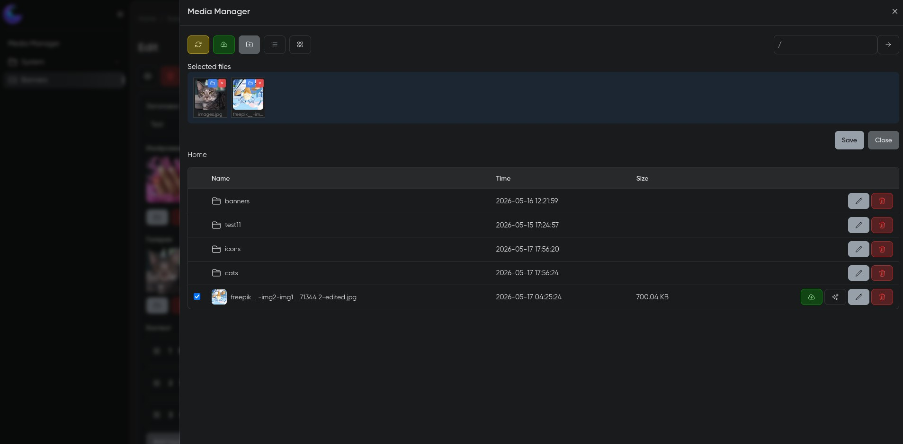
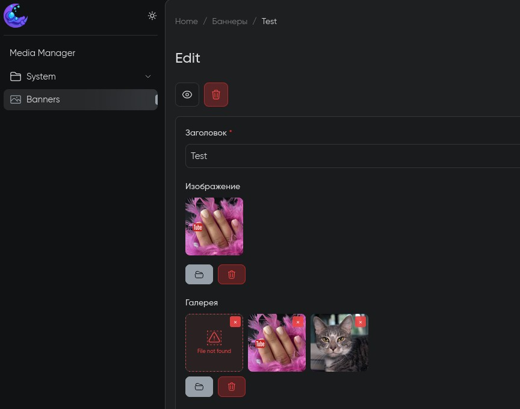

# MoonShine Media Manager

**English** | [Русский](README.ru.md)

A file manager for [MoonShine](https://moonshine-laravel.com/).

### Version support

| MoonShine | Package | Documentation |
|-----------|---------|---------------|
| 4.0+      | 4.x     | [Below ↓](#installation) + [docs/](docs/) |
| 4.0+      | 3.x     | [docs/legacy-versions.md](docs/legacy-versions.md) |
| 3.0+      | 2.x     | [docs/legacy-versions.md](docs/legacy-versions.md) |
| 2.0+      | 1.x     | |

## Screenshots

<table>
    <tr>
        <td align="center"><b>Manager</b></td>
        <td align="center"><b>Picker</b></td>
    </tr>
    <tr>
        <td></td>
        <td></td>
    </tr>
</table>

## Installation

```bash
composer require yurizoom/moonshine-media-manager
php artisan vendor:publish --tag=moonshine-media-manager-assets
php artisan vendor:publish --tag=moonshine-media-manager-config
```

Add the OffCanvas to your layout and — optionally — a menu item: [Getting started](docs/getting-started.md).

## Quick example: picker field in a form

```php
use YuriZoom\MoonShineMediaManager\Fields\MediaManagerPicker;

// Single image
MediaManagerPicker::make('Image', 'image')
    ->allowedTypes(['image']),

// Multiple selection
MediaManagerPicker::make('Gallery', 'images')
    ->multiple()
    ->allowedTypes(['image']),
```

Works with regular fields, Json and Layouts — [details](docs/picker-field.md).

## v4 features

- **AJAX navigation** — browse folders without page reloads
- **Search / filter / sort** — instant search by name, type filter, sort by name / date / size
- **Hide converted formats** — "Hide WebP/AVIF" toggle, state persisted in localStorage
- **Uploads** — multiple files with MIME, extension and size validation; drag-and-drop inside the upload modal
- **Replace file** — overwrite in place, the URL stays the same
- **Move file** — relocate via the folder browser
- **Folders / rename / bulk delete / download**
- **File URL** — view and copy the link
- **Inline validation** — errors right inside the modals, fully localized (en/ru)
- **Two views** — table and grid
- **Table row hover** — dark-mode aware highlight
- **Delete keeps your position** — the list scrolls to and highlights the nearest surviving row
- **Picker remembers the folder** — reopens where you left it
- **Lazy offcanvas** — admin pages that never open the manager fire no extra requests
- **Lazy-load previews** — thumbnails load on scroll
- **Cache-busting** — images refresh automatically after Replace
- **Picker field** — pick files straight from your forms (multiple, filters enforced on upload too, drag-and-drop reorder)
- **Layouts / Json** — full integration with moonshine/layouts-field and Json fields
- **Extensibility** — events (Uploaded/Replaced/Deleted — dispatched per file, even inside deleted folders) and an action registry for third-party packages
- **Guaranteed modal layers** — the manager always floats above foreign overlays ([z-index](docs/configuration.md#modal-layers-z-index))
- **Tested** — 42 tests (PHPUnit + Testbench), CI matrix PHP 8.2/8.3

## Documentation

Guides are available in English and Russian (`*.ru.md`).

| Guide | Description |
|-------|-------------|
| [Getting started](docs/getting-started.md) · [RU](docs/getting-started.ru.md) | Publishing, OffCanvas, menu, verification |
| [Configuration](docs/configuration.md) · [RU](docs/configuration.ru.md) | Options, ENV, authorization, z-index layers |
| [MediaManagerPicker field](docs/picker-field.md) · [RU](docs/picker-field.ru.md) | Filtering, Json, Layouts, behavior |
| [API & events](docs/api.md) · [RU](docs/api.ru.md) | Routes, JSON contract, events, registry |
| [Development](docs/development.md) · [RU](docs/development.ru.md) | Asset builds, package integration |
| [Legacy versions](docs/legacy-versions.md) · [RU](docs/legacy-versions.ru.md) | v3 (MoonShine 4) and v2 (MoonShine 3) setup |

## License

[The MIT License (MIT)](LICENSE).
